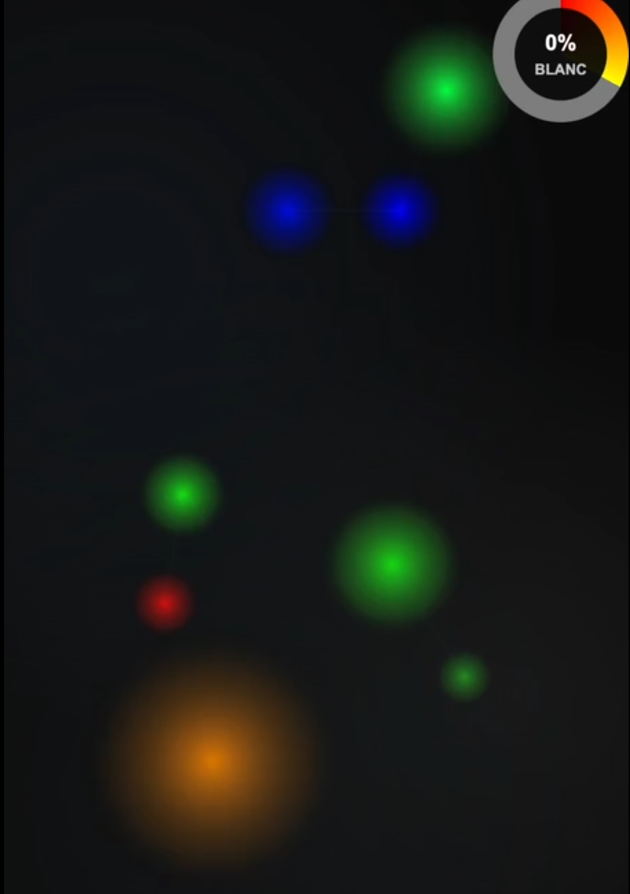

# PseudoLuX

Un jeu interactif de fusion de particules colorées pour créer de la lumière blanche.

## 🎮 Démo

Jouez en ligne : [https://l0d0v1c.github.io/pseudoLux/](https://l0d0v1c.github.io/pseudoLux/)

## 🎯 Objectif

Fusionnez les couleurs primaires (Rouge, Vert, Bleu) pour créer du blanc et atteindre 100% de pureté.

## 🕹️ Contrôles

- **Glisser** : Déplacer les particules
- **Double-clic** : Exploser une particule en 2
- **Clic droit** : Créer une nouvelle particule
- **Mobile** : Glisser/double-taper

## ⚙️ Fonctionnalités

- Système de physique des particules
- Fusion additive des couleurs
- Mode automatique
- Interface tactile mobile
- Réglages personnalisables (attraction, portée, fusion)

## 🎨 Comment jouer

1. Manipulez les particules colorées avec la souris
2. Les particules proches fusionnent automatiquement
3. Observez la jauge de progression du blanc
4. Atteignez 100% pour gagner !

## 🚀 Technologies

- HTML5 Canvas
- JavaScript ES6
- jQuery
- CSS3 (animations et gradients)

